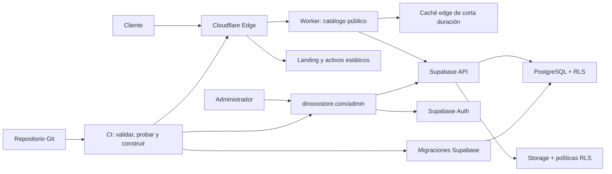

# Arquitectura de Dinoxo Store: Cloudflare + Supabase

Dinoxo Store se construirá con una separación explícita de responsabilidades: **Cloudflare ejecutará y distribuirá las aplicaciones**, mientras que **Supabase administrará PostgreSQL, autenticación y archivos**. El landing seguirá siendo estático; solamente el catálogo y las rutas que necesiten datos actuales ejecutarán código dinámico.

Esta arquitectura permite iniciar en US$0/mes, incorporar un panel para administrar productos y evitar construir autenticación, autorización y almacenamiento desde cero.

## Ruta rápida

1. Crear el storefront con Astro y desplegarlo en Cloudflare Workers.
2. Servir el panel administrativo en la ruta `/admin` del storefront durante v1.
3. Provisionar un proyecto Supabase con migraciones versionadas.
4. Implementar catálogo, autenticación administrativa, Storage y políticas RLS.
5. Mantener estáticos el landing y sus activos; ejecutar Worker solo para rutas dinámicas.
6. Validar seguridad, accesibilidad, rendimiento y permisos antes de producción.

## Decisión técnica

| Área | Decisión v1 |
|---|---|
| DNS, TLS, CDN y protección perimetral | Cloudflare |
| Storefront | Astro + TypeScript estricto sobre Cloudflare Workers |
| Landing | Pre-renderizado y servido como Static Assets |
| Catálogo público | Renderizado con datos de Supabase mediante un Worker delgado y caché edge |
| Panel administrativo | Ruta web estática `/admin` dentro del storefront |
| Base de datos | PostgreSQL administrado por Supabase |
| Autenticación | Supabase Auth, únicamente para administradores en v1 |
| Autorización | Row Level Security en todas las tablas y objetos expuestos |
| Imágenes de productos | Supabase Storage |
| Analítica | Cloudflare Web Analytics, sin trackers publicitarios en v1 |
| Dominio canónico | `https://dinoxostore.com`; `www` redirige al dominio raíz |
| Presupuesto piloto | US$0/mes dentro de las capas gratuitas |

Cloudflare D1 y R2 quedan documentados como alternativas futuras, **no como una segunda base de datos ni como almacenamiento paralelo en v1**.

## Alcance de la primera entrega

### Incluido

- Landing de marca, propuesta de valor y proceso de compra.
- Catálogo público de productos publicados.
- Detalle básico de producto y sus variantes comerciales.
- Panel administrativo para crear, editar, publicar y retirar productos.
- Carga y mantenimiento de imágenes de producto.
- Acceso administrativo autenticado.
- Registro básico de cambios administrativos.
- CTA hacia el canal de venta definido.
- Privacidad, términos, contacto, SEO y metadatos sociales.

### Fuera de alcance

- Carrito, checkout y pagos en línea.
- Cuenta o autenticación de clientes.
- Pedidos, facturación y conciliación.
- Inventario transaccional o reservas en tiempo real.
- Integraciones con proveedores externos.
- D1, KV o R2 como persistencia de negocio.
- Microservicios o colas sin una necesidad comprobada.

Los pedidos y pagos constituyen otro bounded context. No deben añadirse como campos improvisados en las tablas del catálogo.

## Arquitectura de ejecución



### Límites de responsabilidad

| Componente | Responsabilidad | No debe hacer |
|---|---|---|
| Cloudflare Static Assets | Servir HTML, CSS, JS, fuentes e imágenes de interfaz | Contener datos privados o secretos |
| Worker público | Leer productos publicados, validar parámetros y aplicar caché | Saltarse RLS o contener lógica administrativa |
| Panel administrativo | Presentar formularios y operar con la sesión del administrador | Usar `service_role` o decidir permisos solamente en la interfaz |
| Supabase Auth | Identificar administradores y emitir sesiones | Sustituir las políticas de autorización de datos |
| PostgreSQL | Mantener catálogo, integridad, permisos y auditoría | Depender de validaciones exclusivamente cliente |
| Supabase Storage | Guardar imágenes y aplicar permisos de lectura/escritura | Almacenar secretos o datos comerciales estructurados |

## Flujo de datos

### Lectura pública

1. El visitante solicita el catálogo o una página de producto.
2. Cloudflare intenta responder desde caché.
3. Ante un fallo de caché, el Worker consulta Supabase con credenciales públicas.
4. RLS permite leer únicamente productos y variantes publicados.
5. El Worker devuelve un contrato reducido y cacheable.

La caché del catálogo tendrá una duración corta, inicialmente 60 segundos. Un cambio administrativo podrá tardar hasta ese tiempo en aparecer públicamente; este compromiso evita implementar invalidación prematura.

### Escritura administrativa

1. El administrador inicia sesión mediante Supabase Auth.
2. El panel envía su access token en cada operación.
3. PostgreSQL valida el rol mediante RLS.
4. Las restricciones de base de datos validan estados, claves y relaciones.
5. Un trigger registra los cambios relevantes en `audit_log`.

En v1, las operaciones CRUD podrán ir directamente desde el panel hacia Supabase bajo RLS estricta. Cuando existan pedidos, pagos o reglas sensibles, esas mutaciones deberán pasar por una API/BFF en Cloudflare.

### Carga de imágenes

1. El panel valida tipo, dimensiones y peso antes de cargar.
2. Supabase Storage vuelve a validar bucket, ruta y usuario mediante políticas.
3. La base de datos almacena únicamente la referencia del objeto y sus metadatos.
4. El storefront sirve la imagen pública con dimensiones y formatos optimizados.

## Modelo inicial de datos

| Tabla | Propósito | Campos representativos |
|---|---|---|
| `products` | Identidad y contenido comercial del producto | `id`, `slug`, `name`, `description`, `status`, timestamps |
| `product_variants` | Región, plataforma, denominación y precio | `id`, `product_id`, `sku`, `region`, `platform`, `price`, `currency`, `status` |
| `product_media` | Orden y metadatos de imágenes | `id`, `product_id`, `storage_path`, `alt_text`, `position` |
| `admin_users` | Autorizar usuarios administrativos | `user_id`, `role`, `active` |
| `audit_log` | Trazabilidad de cambios relevantes | `actor_id`, `entity`, `entity_id`, `action`, `changed_at`, metadata |

### Reglas de modelado

- Usar UUID como identificadores externos.
- `slug` y `sku` deben ser únicos.
- El dinero se almacena como entero en la unidad monetaria mínima; nunca como `float`.
- `status` se restringe a estados explícitos, por ejemplo `draft`, `published` y `archived`.
- Todo registro mutable incluye `created_at` y `updated_at`.
- No borrar productos publicados físicamente: archivarlos conserva referencias y auditoría.
- Las migraciones SQL versionadas son la fuente de verdad; no hacer cambios manuales irreproducibles en producción.

## Políticas RLS mínimas

RLS estará activa en **todas** las tablas expuestas por la API de Supabase.

| Actor | Operación permitida |
|---|---|
| Público anónimo | `SELECT` únicamente sobre productos y variantes con estado `published` |
| Administrador activo | `SELECT`, `INSERT`, `UPDATE` y archivado lógico del catálogo |
| Administrador inactivo | Ninguna operación administrativa |
| Cliente web | Solo puede leer su propia membresía activa en `admin_users`; nunca accede a `audit_log` |

Reglas no negociables:

- La clave `service_role` **jamás** se entrega al navegador.
- Las variables públicas de Supabase no conceden permisos por sí mismas; RLS es el perímetro real de datos.
- Ocultar botones en el panel no constituye autorización.
- `audit_log` se escribe mediante funciones o triggers controlados, no directamente desde el cliente.
- Las políticas de Storage restringen escritura a administradores activos y al bucket de productos.

Referencias oficiales:

- RLS: <https://supabase.com/docs/guides/database/postgres/row-level-security>
- Storage Access Control: <https://supabase.com/docs/guides/storage/security/access-control>
- Producción: <https://supabase.com/docs/guides/deployment/going-into-prod>

## Arquitectura del repositorio

Una aplicación Astro mantiene dos superficies con comportamientos distintos: landing sin JavaScript y panel interactivo en `/admin`:

```text
DinoxoStore/
├── apps/
│   ├── storefront/                # Astro: landing, catálogo y Worker público
│   │   ├── public/
│   │   ├── src/
│   │   │   ├── admin/             # Controlador cliente del panel
│   │   │   └── pages/
│   │   │       └── admin.astro    # Panel administrativo estático en /admin
│   │   ├── tests/
│   │   ├── astro.config.mjs
│   │   └── wrangler.jsonc
├── brand/                         # Fuente de verdad de identidad
│   ├── assets/
│   └── tokens/brand.css
├── packages/
│   ├── catalog-contracts/         # Tipos y esquemas compartidos
│   └── ui/                        # Solo primitivas realmente compartidas
├── supabase/
│   ├── migrations/                # Esquema, constraints, funciones y RLS
│   ├── seed.sql                   # Datos locales reproducibles
│   └── tests/                     # Pruebas de políticas y funciones
├── docs/architecture/
├── package.json
├── pnpm-workspace.yaml
└── tsconfig.base.json
```

No crear `packages/ui` antes de que exista reutilización real entre ambas aplicaciones. Compartir contratos de datos sí es necesario desde el principio para evitar que storefront, panel y base de datos evolucionen de forma incompatible.

## Frontend público

### Secuencia de contenido

1. **Hero:** marca, promesa concreta, CTA y una imagen dominante.
2. **Cómo funciona:** tres pasos verificables desde la elección hasta la entrega.
3. **Catálogo:** productos publicados con región, plataforma y formato claros.
4. **Confianza:** soporte, condiciones y evidencia real; nunca promesas absolutas.
5. **CTA final:** una acción única y explícita.

### Componentes mínimos

| Grupo | Componentes iniciales |
|---|---|
| UI | `Container`, `ButtonLink`, `Icon`, `Logo`, `SectionHeading` |
| Estructura | `SiteHeader`, `SiteFooter` |
| Secciones | `Hero`, `HowItWorks`, `CatalogPreview`, `Trust`, `FinalCta` |
| Catálogo | `ProductList`, `ProductCard`, `ProductDetail`, `ProductState` |
| SEO | `SeoHead`, `StructuredData` |

El contenido esencial del landing debe funcionar sin JavaScript. Las rutas dinámicas pueden usar hidratación selectiva, pero no se añadirá una biblioteca de estado global al storefront sin una necesidad concreta.

## Panel administrativo

### Capacidades v1

- Iniciar y cerrar sesión.
- Listar y buscar productos.
- Crear y editar productos y variantes.
- Cargar, ordenar y retirar imágenes.
- Guardar borradores.
- Publicar y archivar productos.
- Consultar errores accionables y confirmaciones de operación.

### Reglas de interfaz

- Separar estado de formulario, validación y llamadas de datos.
- No usar una tabla como única experiencia en móvil.
- Confirmar operaciones destructivas o de archivado.
- Impedir envíos duplicados y mostrar progreso de carga.
- Mantener borradores locales solo como recuperación; Supabase sigue siendo la fuente de verdad.
- Mostrar explícitamente si un producto está en `draft`, `published` o `archived`.

## Integración del Brand Kit

1. `brand/tokens/brand.css` continúa como fuente de verdad de color, tipografía, espacio, radio, sombra y movimiento.
2. Storefront y panel consumen variables `--dx-*`; queda prohibido duplicar valores hexadecimales del Brand Kit.
3. El logo 3D raster aprobado permanece como marca principal inmutable.
4. La iconografía funcional permanece en SVG y no intenta redibujar el logo.
5. Las imágenes de producto no deben contener precio, CTA, región o condiciones comerciales; esos datos permanecen como HTML y datos estructurados.
6. El panel prioriza claridad operativa sobre efectos promocionales.

## Rendimiento

| Métrica | Presupuesto v1 |
|---|---:|
| JavaScript inicial del landing | ≤ 70 KB comprimido; objetivo cercano a 0 KB |
| JavaScript inicial del catálogo | ≤ 120 KB comprimido |
| CSS inicial | ≤ 50 KB comprimido |
| Imagen hero móvil | ≤ 250 KB |
| Imagen hero escritorio | ≤ 450 KB |
| LCP móvil p75 | ≤ 2.5 s |
| INP p75 | ≤ 200 ms |
| CLS p75 | ≤ 0.1 |
| Lighthouse Performance | ≥ 90 móvil |

Reglas:

- Generar AVIF y WebP con `srcset` y dimensiones explícitas.
- Paginar el catálogo; no descargar todos los productos ni todos sus campos.
- Seleccionar columnas explícitas en Supabase y evitar `select *`.
- Indexar `slug`, `status`, `product_id`, `sku` y filtros usados realmente.
- Diferir imágenes fuera del primer viewport.
- Medir Worker, egress y consultas antes de optimizar por intuición.

## Accesibilidad

Objetivo mínimo: WCAG 2.2 AA en storefront y panel.

- HTML semántico y jerarquía de encabezados correcta.
- Navegación completa mediante teclado.
- Foco visible y objetivos táctiles de al menos 44 × 44 px.
- Errores de formulario asociados al campo y anunciados a tecnologías asistivas.
- Estados de carga, éxito y error que no dependan únicamente del color.
- Diálogos con gestión correcta de foco y cierre mediante Escape.
- Movimiento sujeto a `prefers-reduced-motion`.
- Textos alternativos editables y obligatorios para imágenes informativas.

## Seguridad y privacidad

La seguridad se diseña por capas; Cloudflare no sustituye la autorización de Supabase.

- Mantener DNSSEC, auto-renew, domain lock y 2FA en Cloudflare.
- Exigir MFA a las cuentas administrativas cuando se habilite producción.
- Restringir el alta de administradores; no habrá registro público para el panel.
- Configurar URLs de redirección de Auth mediante allowlist exacta.
- Rotar credenciales y revocar inmediatamente administradores inactivos.
- Validar datos en interfaz, contrato y base de datos.
- Limitar imágenes por MIME real, extensión, peso y dimensiones.
- No almacenar secretos en variables `PUBLIC_*` ni en el repositorio.
- Definir CSP incluyendo únicamente los orígenes necesarios de Supabase.
- Aplicar `X-Content-Type-Options`, `Referrer-Policy`, `Permissions-Policy` y protección contra framing.
- Registrar operaciones administrativas relevantes sin guardar contraseñas, tokens ni datos sensibles en logs.

Cloudflare Access puede añadirse posteriormente como segunda barrera para `/admin`, pero no reemplazará Supabase Auth ni RLS.

## SEO y descubrimiento

- Canonical a `https://dinoxostore.com/` y redirección 301 de `www`.
- Metadatos únicos por producto publicado.
- `sitemap.xml` generado únicamente con rutas públicas.
- `robots.txt`, Open Graph y Twitter Card.
- Datos estructurados `Organization`, `WebSite` y `Product` solo con información real.
- Los productos en borrador o archivados no son indexables ni accesibles públicamente.
- No afirmar “oficial”, “distribuidor autorizado”, “100% seguro” o “entrega instantánea” sin evidencia.

## Entornos y configuración

| Entorno | Storefront | Admin | Supabase |
|---|---|---|---|
| Local | `localhost` | `localhost/admin` | Supabase local |
| Preview | URL temporal `workers.dev` | `/admin` en la preview no indexable | Proyecto de desarrollo o entorno aislado |
| Producción | `dinoxostore.com` | `dinoxostore.com/admin` | Proyecto de producción |

Reglas:

- Preview y producción nunca comparten datos administrativos.
- Un build preview sin overrides aislados falla; jamás hereda el proyecto productivo.
- Las previews envían `X-Robots-Tag: noindex`.
- Las variables de entorno se configuran en Cloudflare y CI, no en archivos versionados.
- Las migraciones se prueban localmente y se aplican automáticamente antes del despliegue compatible.
- Un fallo de migración detiene el despliegue; no se corrige manualmente en producción.

## Pipeline obligatorio

```text
install --frozen-lockfile
→ format:check
→ lint
→ typecheck
→ unit tests
→ Supabase migration reset
→ RLS and database tests
→ build storefront, incluida la ruta /admin
→ accessibility smoke
→ Playwright responsive and admin flows
→ Lighthouse CI
→ apply production migrations
→ deploy
→ production smoke
```

## Estrategia de pruebas

| Nivel | Evidencia mínima |
|---|---|
| Dominio y contratos | Estados, dinero, slugs y variantes validados |
| Base de datos | Migraciones reproducibles, constraints y triggers |
| RLS | Público solo lee publicados; no-admin no escribe; admin activo sí |
| Storage | Público lee imágenes; solo admin activo carga, actualiza o elimina |
| Worker | Contrato estable, parámetros validados, errores seguros y caché correcta |
| Storefront | Navegación, catálogo, SEO, responsive y accesibilidad |
| Panel | Login, expiración de sesión, CRUD, carga de imágenes y errores |
| Producción | HTTP 200, headers, canonical, acceso público y bloqueo administrativo |

Casos críticos:

- Manipular el rol o `user_id` desde el navegador no concede permisos.
- Una sesión expirada obliga a reautenticar sin perder silenciosamente el formulario.
- Un producto en borrador nunca aparece en el catálogo ni en el sitemap.
- Archivar un producto lo retira del público sin eliminar su historial.
- Una imagen inválida o excesiva se rechaza antes y durante la carga.
- Si Supabase falla, el storefront muestra un estado controlado y no filtra detalles internos.

## Costos y umbrales de evolución

### Piloto

- Cloudflare Workers Free: activos estáticos gratuitos y hasta 100 000 solicitudes dinámicas diarias.
- Supabase Free: 500 MB de PostgreSQL, 1 GB de Storage y 5 GB de egress más 5 GB cacheados.
- Costo de plataforma esperado: US$0/mes mientras el uso permanezca dentro de límites.

### Producción estable

Supabase Free puede pausar proyectos con baja actividad y no incluye las garantías operativas necesarias para una tienda crítica. Antes de depender comercialmente del catálogo, presupuestar Supabase Pro desde US$25/mes y revisar copias de seguridad, SMTP, observabilidad y límites.

Referencias:

- Cloudflare Workers: <https://developers.cloudflare.com/workers/platform/pricing/>
- Supabase Pricing: <https://supabase.com/pricing>
- Supabase Free Project Pausing: <https://supabase.com/docs/guides/platform/free-project-pausing>

### Señales para evolucionar

- Más de 80% de cualquier cuota gratuita sostenida durante dos semanas.
- Necesidad contractual de no pausar, restaurar o respaldar automáticamente.
- Incorporación de pedidos, pagos o datos personales de clientes.
- Mutaciones con reglas de negocio que requieran idempotencia o transacciones controladas.
- Catálogo cuyo tráfico o egress justifique mover imágenes a Cloudflare R2.

## Definition of Done

- [ ] Landing servido como activo estático y rutas dinámicas limitadas al catálogo.
- [ ] Storefront y panel se despliegan independientemente en Cloudflare.
- [ ] Esquema PostgreSQL completo mediante migraciones versionadas.
- [ ] RLS habilitada y probada en todas las tablas expuestas.
- [ ] Ninguna clave `service_role` aparece en navegador, build o repositorio.
- [ ] Público solo puede consultar productos publicados.
- [ ] Administradores inactivos o no autorizados no pueden modificar datos ni archivos.
- [ ] CRUD de productos, variantes e imágenes funciona de extremo a extremo.
- [ ] Auditoría registra publicación, edición y archivado.
- [ ] WCAG 2.2 AA y navegación por teclado verificadas.
- [ ] Presupuestos de rendimiento pasan en CI.
- [ ] Canonical, sitemap, robots, Open Graph y datos estructurados son correctos.
- [ ] CSP y encabezados de seguridad están activos en ambos dominios.
- [ ] Preview no es indexable y producción sí.
- [ ] DNSSEC, 2FA, domain lock y auto-renew permanecen activos.
- [ ] Costos y uso de cuotas se revisan mensualmente.

## Próxima decisión antes de implementar

Definir el catálogo inicial: tipos de producto, variantes, estados, moneda, regiones, reglas de precio y campos obligatorios. El esquema y las políticas RLS deben derivarse de ese modelo, no de formularios construidos por intuición.
